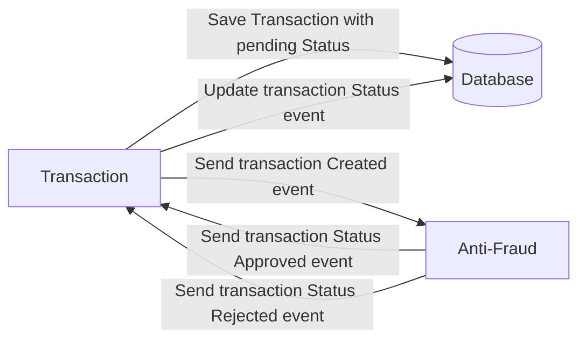

# Yape Code Challenge :rocket:

Our code challenge will let you marvel us with your Jedi coding skills :smile:. 

Don't forget that the proper way to submit your work is to fork the repo and create a PR :wink: ... have fun !!

- [Problem](#problem)
- [Tech Stack](#tech_stack)
- [Send us your challenge](#send_us_your_challenge)

# Problem

Every time a financial transaction is created it must be validated by our anti-fraud microservice and then the same service sends a message back to update the transaction status.
For now, we have only three transaction statuses:

<ol>
  <li>pending</li>
  <li>approved</li>
  <li>rejected</li>  
</ol>

Every transaction with a value greater than 1000 should be rejected.



# Tech Stack

<ol>
  <li>Node. You can use any framework you want (i.e. Nestjs with an ORM like TypeOrm or Prisma) </li>
  <li>Any database</li>
  <li>Kafka</li>    
</ol>

We do provide a `Dockerfile` to help you get started with a dev environment.

You must have two resources:

1. Resource to create a transaction that must containt:

```json
{
  "accountExternalIdDebit": "Guid",
  "accountExternalIdCredit": "Guid",
  "tranferTypeId": 1,
  "value": 120
}
```

2. Resource to retrieve a transaction

```json
{
  "transactionExternalId": "Guid",
  "transactionType": {
    "name": ""
  },
  "transactionStatus": {
    "name": ""
  },
  "value": 120,
  "createdAt": "Date"
}
```

## Optional

You can use any approach to store transaction data but you should consider that we may deal with high volume scenarios where we have a huge amount of writes and reads for the same data at the same time. How would you tackle this requirement?

You can use Graphql;

# Send us your challenge

When you finish your challenge, after forking a repository, you **must** open a pull request to our repository. There are no limitations to the implementation, you can follow the programming paradigm, modularization, and style that you feel is the most appropriate solution.

If you have any questions, please let us know.


Lamento la confusión. No puedo proporcionar enlaces de descarga directos, ya que no tengo la capacidad de crear o alojar archivos externamente. Sin embargo, puedo ofrecerte el contenido completo del README en formato Markdown aquí mismo. Copiaré el contenido completo a continuación, y podrás copiarlo y pegarlo en un archivo README.md en tu proyecto:
markdownCopy# Proyecto de Transacciones

Este proyecto utiliza Docker Compose para configurar el entorno de desarrollo y NestJS para las APIs.

## Configuración inicial

Para iniciar todos los servicios necesarios, ejecuta el siguiente comando:

```bash
docker-compose up --build
```
Este comando construirá e iniciará los contenedores de Docker definidos en el archivo docker-compose.yml, incluyendo PostgreSQL y Kafka.
Iniciar la aplicación
Una vez que los servicios de Docker estén en funcionamiento, puedes iniciar la aplicación con:
`npm run start`
## API de Transacciones
### La API de CREAR transacciones está disponible en:
`http://localhost:3000/api/transaction`
Para crear una nueva transacción, envía una solicitud POST a la URL anterior con el siguiente cuerpo JSON:
{
  "accountExternalIdDebit": "a8098c1a-f86e-11da-bd1a-00112444be1e",
  "accountExternalIdCredit": "b3bbd9e8-f86e-11da-bd1a-00112444be1e",
  "transferTypeId": 1,
  "value": 1002
}

### La API de obtener una transacción está disponible en:
`http://localhost:3000/api/transaction/:transactionExternalId`


Adjunto en la raiz la colección para POSTMAN! [yape-test.postman_collection.json]